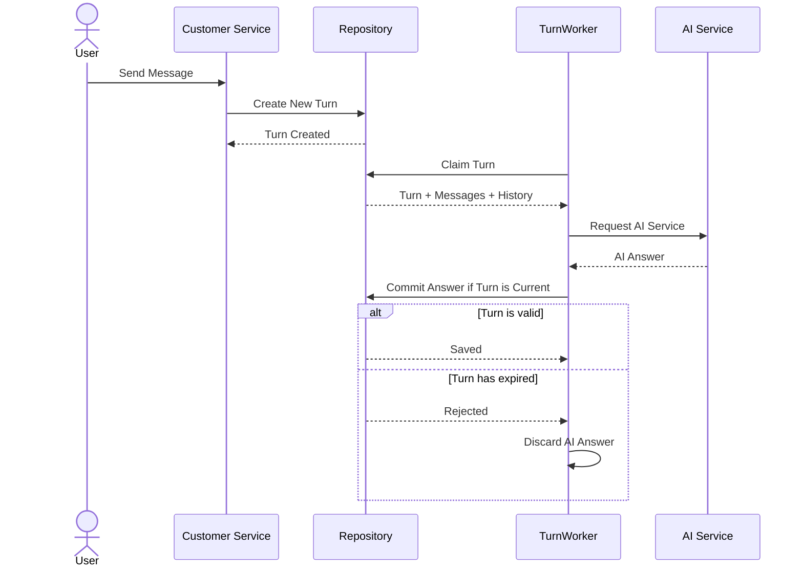

# TurnWorker 获取会话轮次的流程

```mermaid
sequenceDiagram
    actor User
    participant CS as Customer Service
    participant R as Repository
    participant W as TurnWorker
    participant AI as AI Service

    User->>CS: Send Message
    CS->>R: Create New Turn
    R-->>CS: Turn Created

    W->>R: Claim Turn
    R-->>W: Turn + Messages + History

    W->>AI: Request AI Service
    AI-->>W: AI Answer

    W->>R: Commit Answer if Turn is Current

    alt Turn is valid
        R-->>W: Saved
    else Turn has expired
        R-->>W: Rejected
        W->>W: Discard AI Answer
    end
```
